# Applied-Machine-Learning

- Used R to implement and run various machine learning algorithms on given data sets
- Used TensorFlow and Python to explore various deep neural network architectures (Assignment 8)
- ** Note: see relevant reports of more detailed analysis and other of what is shown below (click on "Assignment[X]")**

##### Assignment 1
- Implemented [Naive Bayes](http://luthuli.cs.uiuc.edu/~daf/courses/LearningCourse/learning-book-19-jan-small.pdf#page=17) classifier to predict G3 scores of [student performance in Portugal](https://archive.ics.uci.edu/ml/datasets/Student+Performance) using binary and multinomial models
- Performed classification with and without NA entries
- Performed classification using [klaR](https://cran.r-project.org/web/packages/klaR/index.html), [caret](https://cran.r-project.org/web/packages/caret/index.html) R packages
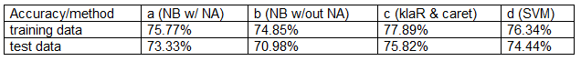

##### Assignment 2
- Implemented [SVM](http://luthuli.cs.uiuc.edu/~daf/courses/LearningCourse/learning-book-1-feb.pdf#page=21) classifier using [stochastic gradient descent](http://luthuli.cs.uiuc.edu/~daf/courses/LearningCourse/learning-book-1-feb.pdf#page=25) using various regularization constants to predict adult income data [UC Irvine machine learning data repository](https://archive.ics.uci.edu/ml/datasets/Adult)
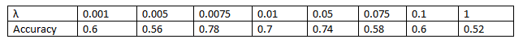

##### Assignment 3
- Trained and evaluated [Linear SVM](http://luthuli.cs.uiuc.edu/~daf/courses/LearningCourse/learning-book-16-feb.pdf#page=22) ([SVMlight](http://svmlight.joachims.org/)), [Naive Bayes](http://luthuli.cs.uiuc.edu/~daf/courses/LearningCourse/learning-book-16-feb.pdf#page=18), and [Random Forest](http://luthuli.cs.uiuc.edu/~daf/courses/LearningCourse/learning-book-16-feb.pdf#page=31) ([randomforest](https://cran.r-project.org/web/packages/randomForest/index.html)) classifiers on facial recognition data provided on [Kaggle](https://inclass.kaggle.com/c/cs498df-1/data)

  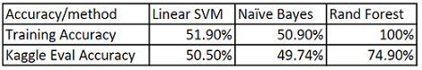
- Ran [RANN](https://cran.r-project.org/web/packages/RANN/index.html)'s [approximate nearest neighbor](https://cran.r-project.org/web/packages/RANN/RANN.pdf#page=2) algorithm to match [public figures](http://www.cs.columbia.edu/CAVE/databases/pubfig/download/) from a database provided by [Columbia's Public Figures Face Database](http://www.cs.columbia.edu/CAVE/databases/pubfig/)

  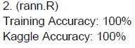
- Ran [SVMlight](http://svmlight.joachims.org/)'s polynomial kernel to match [public figures](http://www.cs.columbia.edu/CAVE/databases/pubfig/download/) from a database provided by [Columbia's Public Figures Face Database](http://www.cs.columbia.edu/CAVE/databases/pubfig/)
  - Training accuracy: 80.1 %
  - Kaggle Eval: 76.480 %
  - Results on [Kaggle leaderboard](https://inclass.kaggle.com/c/cs498df-1/leaderboard) "Skynet Dev Team"

##### [Assignment 4](https://github.com/hkiang01/Applied-Machine-Learning/blob/master/assignment4/Assignment4Report.pdf)
  - Plotted a [scatter matrix](http://luthuli.cs.uiuc.edu/~daf/courses/LearningCourse/learning-book-28-April.pdf#page=60) of the [iris dataset](https://archive.ics.uci.edu/ml/machine-learning-databases/iris/iris.data) from the [UC Irvine learning data repository](https://archive.ics.uci.edu/ml/)
   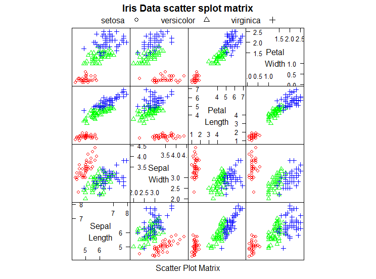

- Plotted the above data on first two [principal components](http://luthuli.cs.uiuc.edu/~daf/courses/LearningCourse/learning-book-28-April.pdf#page=76)
   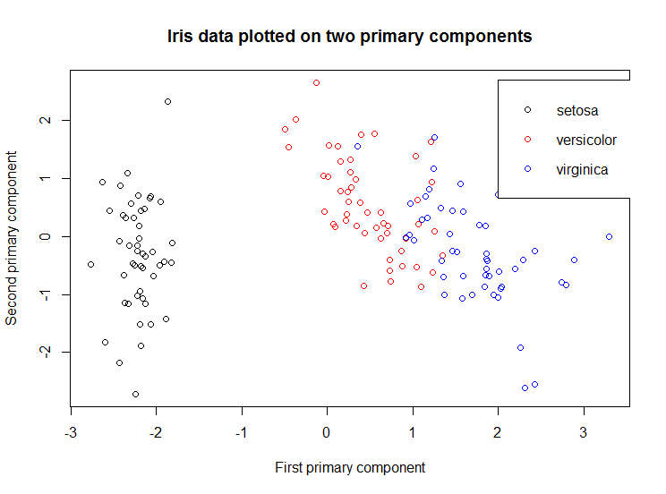

- Plotted above [data](https://archive.ics.uci.edu/ml/machine-learning-databases/iris/iris.data) using [NIPALS](http://luthuli.cs.uiuc.edu/~daf/courses/LearningCourse/learning-book-16-feb.pdf#page=84) algorithm for [PLS1 regression](http://artax.karlin.mff.cuni.cz/r-help/library/chemometrics/html/pls1_nipals.html)
  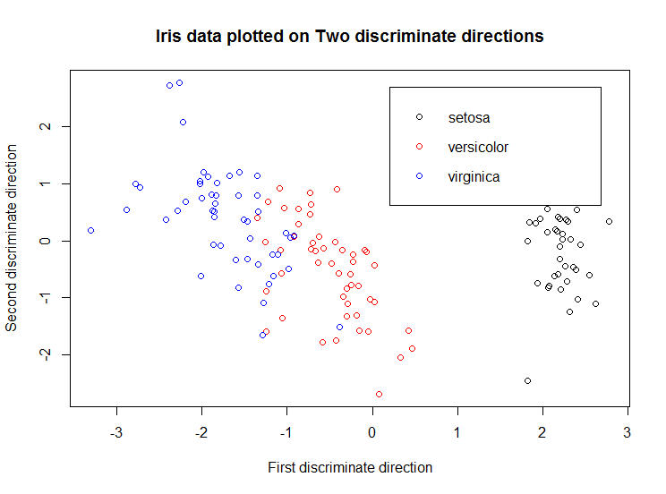

- Plotted the [eigenvalues of the covariance matrix](http://luthuli.cs.uiuc.edu/~daf/courses/LearningCourse/learning-book-16-feb.pdf#page=95) in sorted order [principal components](http://luthuli.cs.uiuc.edu/~daf/courses/LearningCourse/learning-book-28-April.pdf#page=76) of the [wine dataset](https://archive.ics.uci.edu/ml/datasets/Wine) provided by the [UC Irvine Machine Learning Repository](https://archive.ics.uci.edu/ml/datasets.html) using NIPALS
  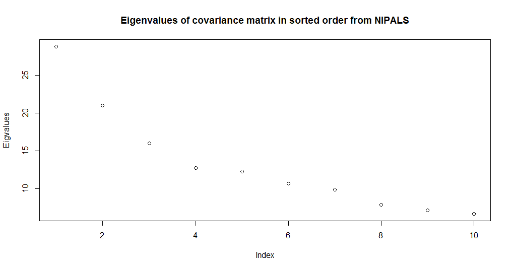

- Plotted a stem plot of the first 3 [principal components](http://luthuli.cs.uiuc.edu/~daf/courses/LearningCourse/learning-book-28-April.pdf#page=76) of the above [data](https://archive.ics.uci.edu/ml/datasets/Wine). Below is the first principal component
  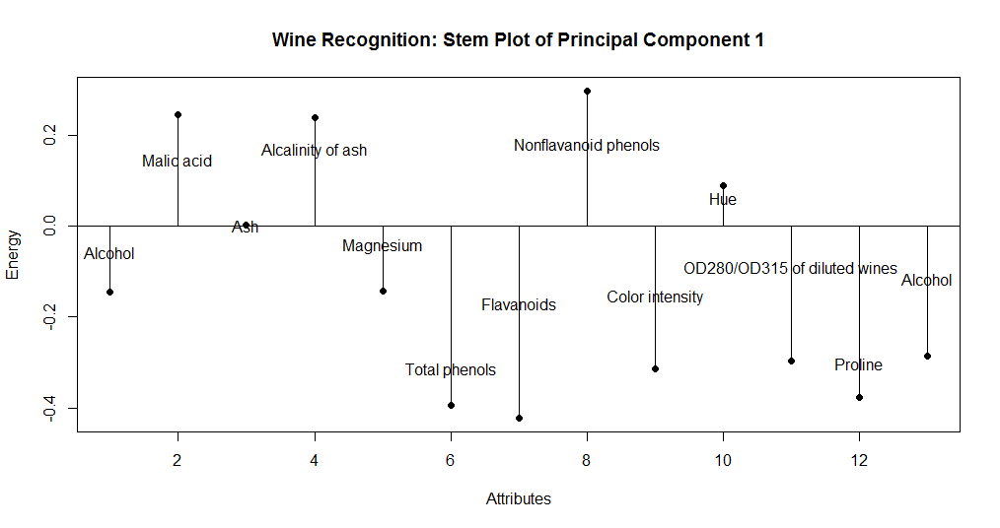

- Plotted the above [data](https://archive.ics.uci.edu/ml/datasets/Wine) on first two [principal components](http://luthuli.cs.uiuc.edu/~daf/courses/LearningCourse/learning-book-28-April.pdf#page=76)
  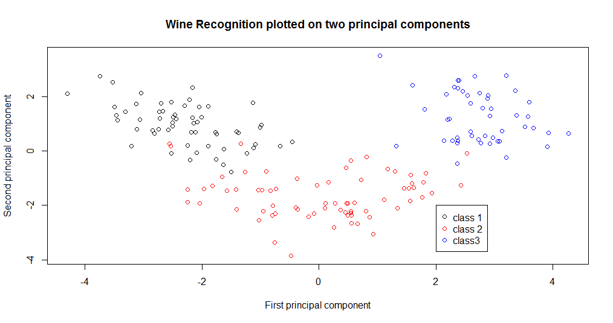

- Plotted [data on breast cancer diagnostics](https://archive.ics.uci.edu/ml/datasets/Breast+Cancer+Wisconsin+(Diagnostic)) provided by the [UC Irvine learning data repository](https://archive.ics.uci.edu/ml/) across 3 [principal components](http://luthuli.cs.uiuc.edu/~daf/courses/LearningCourse/learning-book-28-April.pdf#page=76)

  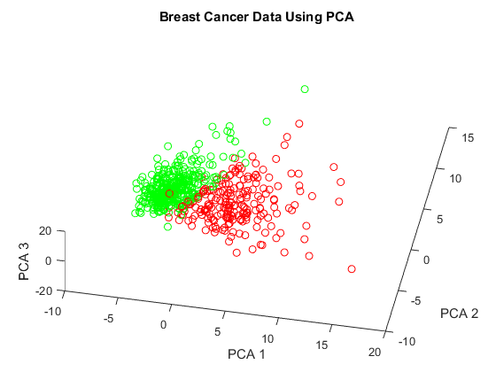

- Plotted [data on breast cancer diagnostics](https://archive.ics.uci.edu/ml/datasets/Breast+Cancer+Wisconsin+(Diagnostic)) provided by the [UC Irvine learning data repository](https://archive.ics.uci.edu/ml/) across 3 [discriminate directions](http://luthuli.cs.uiuc.edu/~daf/courses/LearningCourse/learning-book-28-April.pdf#page=76) using [NIPALS](http://luthuli.cs.uiuc.edu/~daf/courses/LearningCourse/learning-book-16-feb.pdf#page=84) algorithm for [PLS1 regression](http://artax.karlin.mff.cuni.cz/r-help/library/chemometrics/html/pls1_nipals.html)

    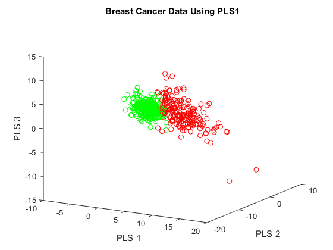

##### [Assignment 5](assignment5/HW5Report.pdf)
- Using the [EM algorithm](http://luthuli.cs.uiuc.edu/~daf/courses/LearningCourse/learning-book-28-April.pdf#page=135) implemented a [multinomial mixture of topics model](http://luthuli.cs.uiuc.edu/~daf/courses/LearningCourse/learning-book-28-April.pdf#page=133) using the [NIPS dataset](https://archive.ics.uci.edu/ml/machine-learning-databases/bag-of-words/) from the [UCI Machine Learning dataset repository](https://archive.ics.uci.edu/ml/datasets/Bag+of+Words) to generate [clusters](http://luthuli.cs.uiuc.edu/~daf/courses/LearningCourse/learning-book-28-April.pdf#page=130) of topics and plot their priors
  

- Plotted the most common words per cluster of the above  
  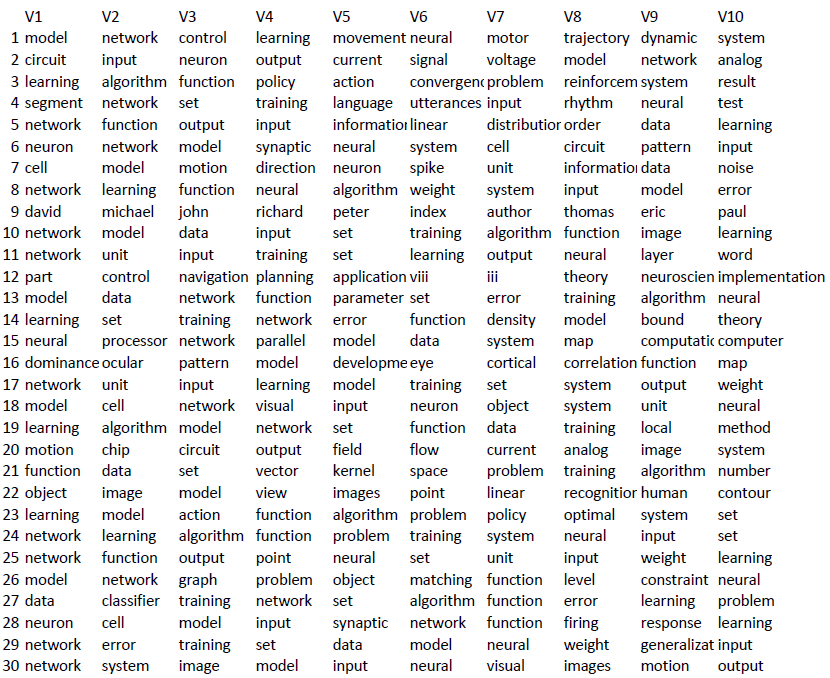
- Using the [EM algorithm](http://luthuli.cs.uiuc.edu/~daf/courses/LearningCourse/learning-book-28-April.pdf#page=135)  applied to a [mixture of normal distribution model](http://luthuli.cs.uiuc.edu/~daf/courses/LearningCourse/learning-book-28-April.pdf#page=136),  segmented [color images](https://github.com/hkiang01/Applied-Machine-Learning/tree/master/assignment5/image_results) over [multiple iterations](assignment5/PolarLightsAnalysis.pdf). Below is an image segmented using 20 clusters over 5 iterations.

  

##### [Assignment 6](assignment6/Assignment6report_updated.pdf)
- Implemented [linear regression](http://luthuli.cs.uiuc.edu/~daf/courses/LearningCourse/learning-book-31-Mar#page=147.pdf) on the [Geographical Original of Music Data Set](https://archive.ics.uci.edu/ml/datasets/Geographical+Original+of+Music) provided by the [UCI Machine Learning Repository](https://archive.ics.uci.edu/ml/index.html)
- Plotted a straightforward [linear regression](http://luthuli.cs.uiuc.edu/~daf/courses/LearningCourse/learning-book-31-Mar#page=147.pdf) against features with respect to longitude and latitude of origin of said [music data set](https://archive.ics.uci.edu/ml/datasets/Geographical+Original+of+Music).
- Below is a latitude prediction over a [linear regression](http://luthuli.cs.uiuc.edu/~daf/courses/LearningCourse/learning-book-31-Mar#page=147.pdf) on features that yields an [R-squared](http://luthuli.cs.uiuc.edu/~daf/courses/LearningCourse/learning-book-31-Mar#page=151.pdf)) value of 0.3645767
  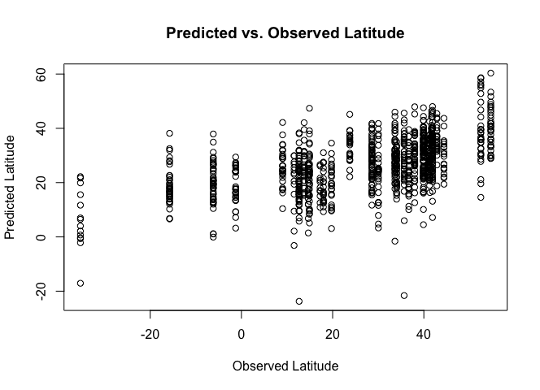

- Analyzed the [residuals](http://luthuli.cs.uiuc.edu/~daf/courses/LearningCourse/learning-book-31-Mar#page=150.pdf). Below are that of the latitude
  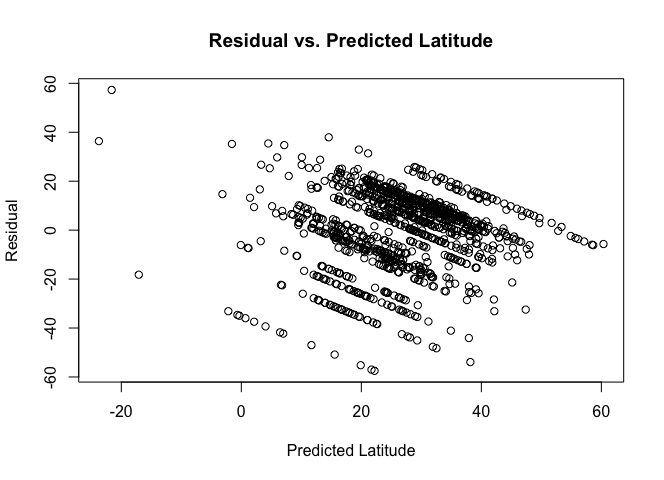

- Produced a [Box Cox](http://luthuli.cs.uiuc.edu/~daf/courses/LearningCourse/learning-book-31-Mar#page=155.pdf) transformation and analyzed its effect on [linear regression](http://luthuli.cs.uiuc.edu/~daf/courses/LearningCourse/learning-book-31-Mar#page=147.pdf) performance. Below is a Box Cox plot with a max log likelihood value $$\lambda$$ of 3.6
  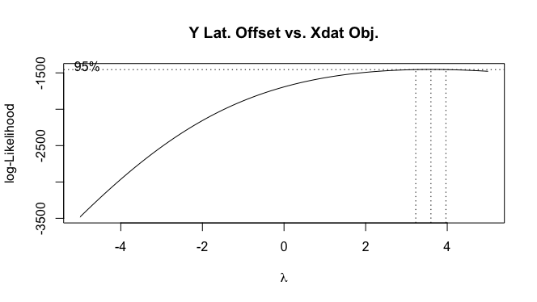

- Performed a [ridge regression](http://luthuli.cs.uiuc.edu/~daf/courses/LearningCourse/learning-book-31-Mar#page=168.pdf) analysis ($$\alpha$$ values close to 0) using  various [regularization coefficients](http://luthuli.cs.uiuc.edu/~daf/courses/LearningCourse/learning-book-31-Mar#page=200.pdf)
  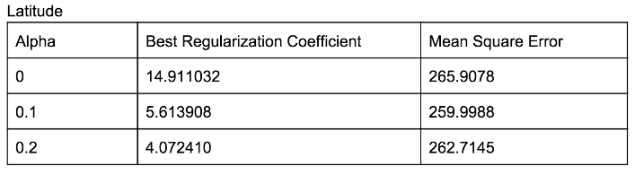

- Below is a plot showing [cross-validated error](http://luthuli.cs.uiuc.edu/~daf/courses/LearningCourse/learning-book-31-Mar#page=167.pdf) against [log regularization coefficient]((http://luthuli.cs.uiuc.edu/~daf/courses/LearningCourse/learning-book-31-Mar#page=200.pdf) for $$\alpha = 0.1$$ ([ridge regression](http://luthuli.cs.uiuc.edu/~daf/courses/LearningCourse/learning-book-31-Mar#page=168.pdf)) (see [report]((assignment6/Assignment6report_updated.pdf)) for detailed analysis)
  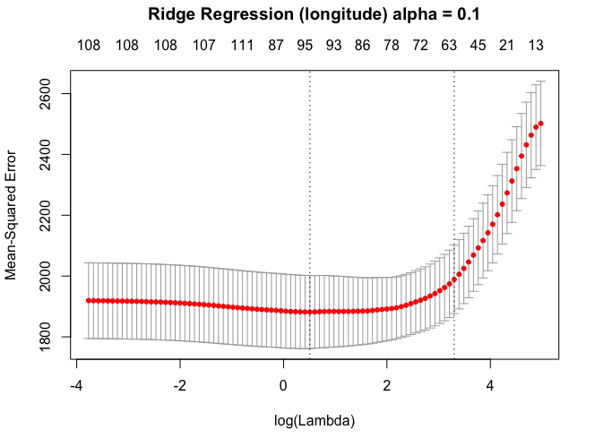

- [Lasso](http://luthuli.cs.uiuc.edu/~daf/courses/LearningCourse/learning-book-31-Mar#page=196.pdf) and [Elastic Net Regression](http://luthuli.cs.uiuc.edu/~daf/courses/LearningCourse/learning-book-31-Mar#page=197.pdf) were performed and analyzed in a similar manner with their associated [log regularization coefficients](http://luthuli.cs.uiuc.edu/~daf/courses/LearningCourse/learning-book-31-Mar#page=200.pdf) $$\alpha$$ (see [report](assignment6/Assignment6report_updated.pdf) for more details)

- A comparison of [Unregularized](http://luthuli.cs.uiuc.edu/~daf/courses/LearningCourse/learning-book-31-Mar#page=199.pdf), [Lasso](http://luthuli.cs.uiuc.edu/~daf/courses/LearningCourse/learning-book-31-Mar#page=196.pdf), [Ridge](http://luthuli.cs.uiuc.edu/~daf/courses/LearningCourse/learning-book-31-Mar#page=168.pdf), and [Elastic Net Regression](http://luthuli.cs.uiuc.edu/~daf/courses/LearningCourse/learning-book-31-Mar#page=197.pdf) on the [Geographical Original of Music Data Set](https://archive.ics.uci.edu/ml/datasets/Geographical+Original+of+Music) provided by the [UCI Machine Learning Repository](https://archive.ics.uci.edu/ml/index.html)
  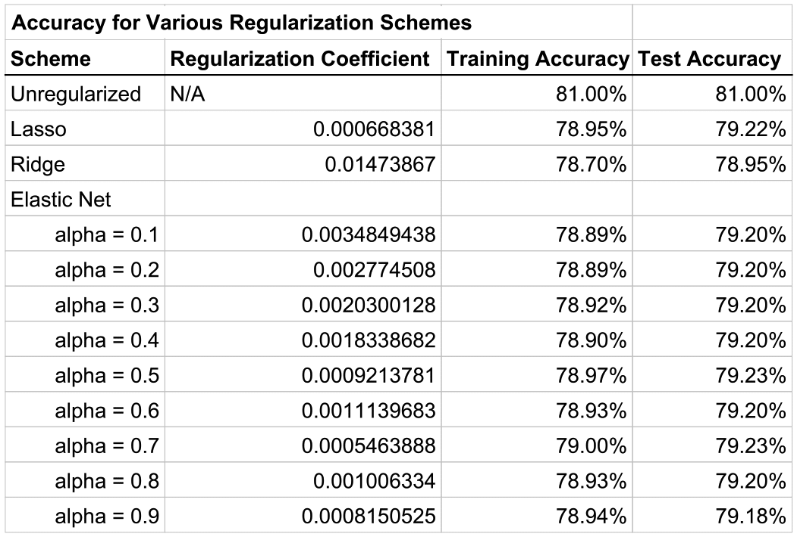

##### [Assignment 7](assignment7/Assignment7Report.pdf)
- Analyzed regression of [spatial data](http://luthuli.cs.uiuc.edu/~daf/courses/LearningCourse/learning-book-31-Mar#page=277.pdf) using [kernel functions](http://luthuli.cs.uiuc.edu/~daf/courses/LearningCourse/learning-book-31-Mar#page=206.pdf), specifically data on [temperature measurements](http://www.geos.ed.ac.uk/homes/s0198247/Data.html) from 112 weather stations in Oregon provided by [Luke Spadavecchia](http://www.geos.ed.ac.uk/homes/s0198247/) of the [University of Edinburgh](http://www.ed.ac.uk/)
- Used [kernel smoothing](http://luthuli.cs.uiuc.edu/~daf/courses/LearningCourse/learning-book-31-Mar#page=213.pdf) to predict the average minimum annual temperature at each point on a 100x100 grid spanning these stations through the use of a [Gaussian kernel](http://luthuli.cs.uiuc.edu/~daf/courses/LearningCourse/learning-book-31-Mar#page=206.pdf). A scale was chosen through [cross-validation](http://luthuli.cs.uiuc.edu/~daf/courses/LearningCourse/learning-book-31-Mar#page=209.pdf), and combined to create the image below. This closely matches with [Figure 4](http://www.geos.ed.ac.uk/homes/s0198247/krig.png) which displays the result obtained from [ordinary Kriging](http://www.geos.ed.ac.uk/homes/s0198247/Geostats.html) (see the [report](assignment7/Assignment7Report.pdf) for further analysis).
  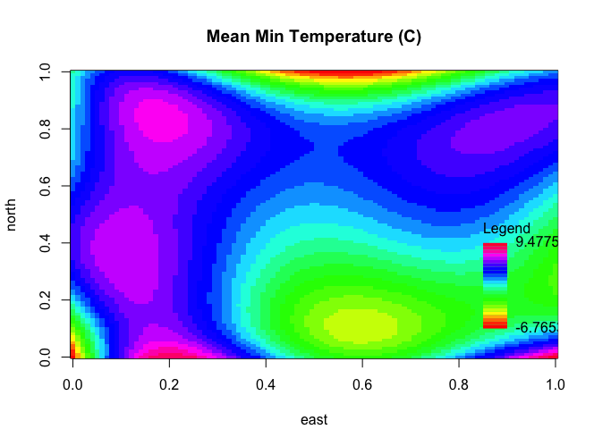

- Regularized the [kernel method](http://luthuli.cs.uiuc.edu/~daf/courses/LearningCourse/learning-book-31-Mar#page=206.pdf) shown [here](http://luthuli.cs.uiuc.edu/~daf/courses/LearningCourse/learning-book-31-Mar#page=212.pdf) using lasso, and again predicted the average minimum annual temperatures across the 100x100 grid. As above,  scale was chosen through [cross-validation](http://luthuli.cs.uiuc.edu/~daf/courses/LearningCourse/learning-book-31-Mar#page=209.pdf), and combined to create the image below (see [report](assignment7/Assignment7Report.pdf) for images corresponding to a wider array of scales and [kernel functions](http://luthuli.cs.uiuc.edu/~daf/courses/LearningCourse/learning-book-31-Mar#page=206.pdf)).
  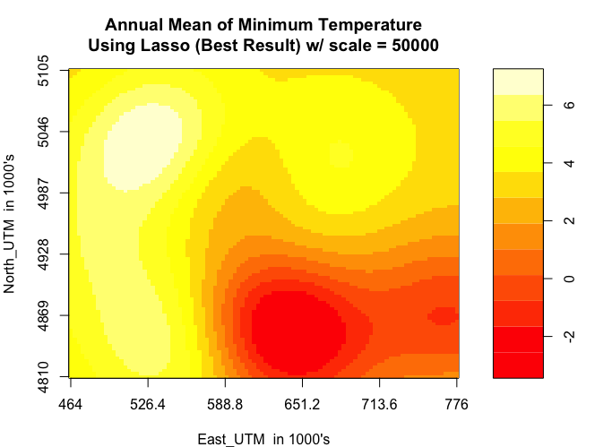

- Plotted the impact of the number of predictors on accuracy, much like in [Figure 7.17](http://luthuli.cs.uiuc.edu/~daf/courses/LearningCourse/learning-book-31-Mar#page=172.pdf). Note that the [mean square error](http://luthuli.cs.uiuc.edu/~daf/courses/LearningCourse/learning-book-31-Mar#page=172.pdf) decreases from 0 to 24 predictors, where the regularization constant results in the residual hitting a [knee](http://luthuli.cs.uiuc.edu/~daf/courses/LearningCourse/learning-book-31-Mar#page=112.pdf) indicating the point of diminishing returns.
  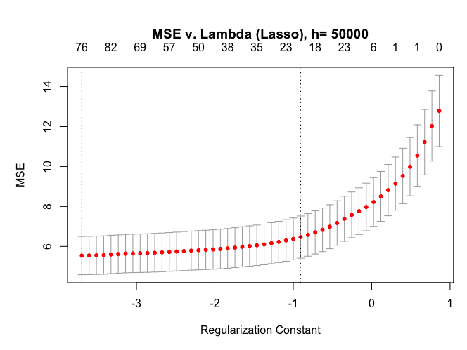

- A similar procedure was performed with [Elastic Net Regression](http://luthuli.cs.uiuc.edu/~daf/courses/LearningCourse/learning-book-31-Mar#page=197.pdf) (see [report](assignment7/Assignment7Report.pdf))

##### [Assignment 8](assignment8/HW8Report.pdf)
- Worked with Google's [TensorFlow](https://www.tensorflow.org/) in analyzing how [convolutional neural networks](http://luthuli.cs.uiuc.edu/~daf/courses/LearningCourse/learning-book-28-April#page=243.pdf) are used to classify written digits from the [MNIST database](http://yann.lecun.com/exdb/mnist/), and analyzing the results using [TensorBoard](https://www.tensorflow.org/versions/r0.7/how_tos/summaries_and_tensorboard/index.html). This closely follows the [Deep MNIST for Experts tutorial](https://www.tensorflow.org/versions/r0.9/tutorials/mnist/pros/index.html#deep-mnist-for-experts).
- Plotted accuracy of the [convolutional neural networks](http://luthuli.cs.uiuc.edu/~daf/courses/LearningCourse/learning-book-28-April#page=243.pdf) over the number of steps, in this case nearly 2000, which yields a very impressive at nearly 97.44%!
  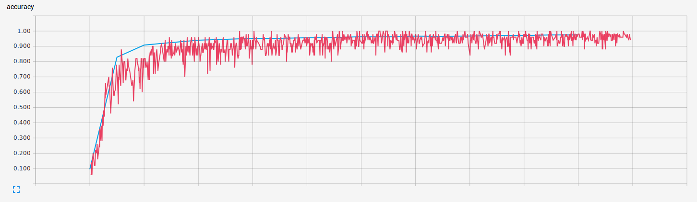

- Modified the [convolutional neural networks](http://luthuli.cs.uiuc.edu/~daf/courses/LearningCourse/learning-book-28-April#page=243.pdf) from the [Deep MNIST for Experts tutorial](https://www.tensorflow.org/versions/r0.9/tutorials/mnist/pros/index.html#deep-mnist-for-experts) in an effort to derive a better result.
- Below is a plot of the accuracy of a network with the following configuration:
  - 7x7 kernel, 32 features, no [max pooling](http://deeplearning.net/tutorial/lenet.html#maxpooling), 3 convolutional layers deep (see [report](assignment8/HW8Report.pdf) for more details and configurations)
  - Note that a peak accuracy of around 98% is achieved after a minimal number of steps
  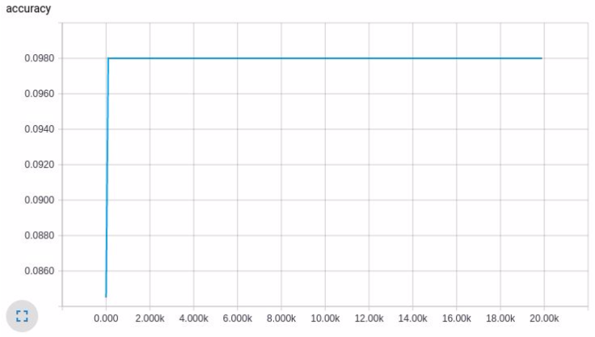

- A similar procedure was executed for the [CIFAR](https://www.tensorflow.org/versions/r0.7/tutorials/deep_cnn/index.html) data set
